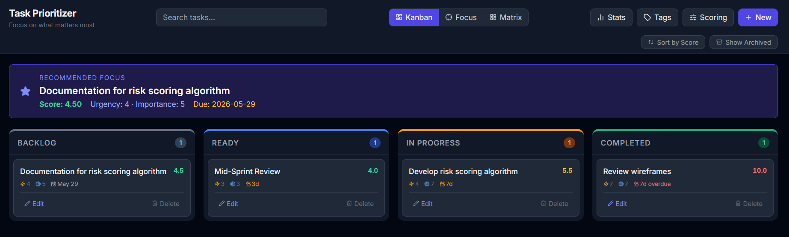
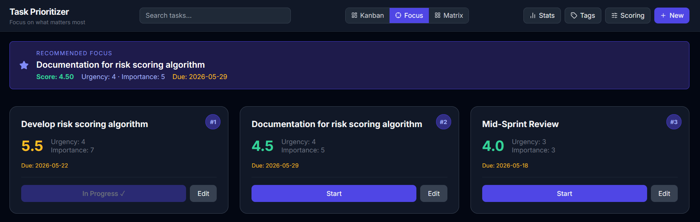
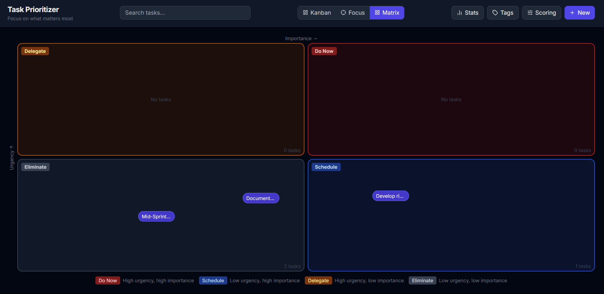
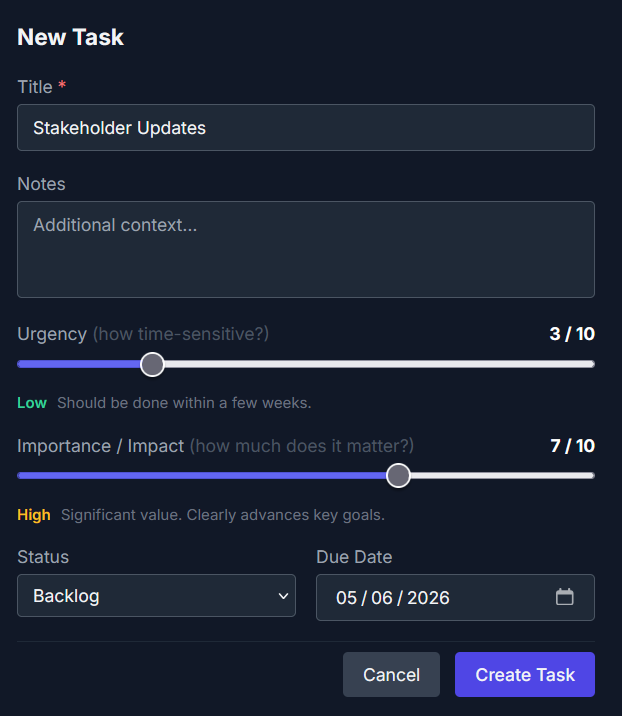
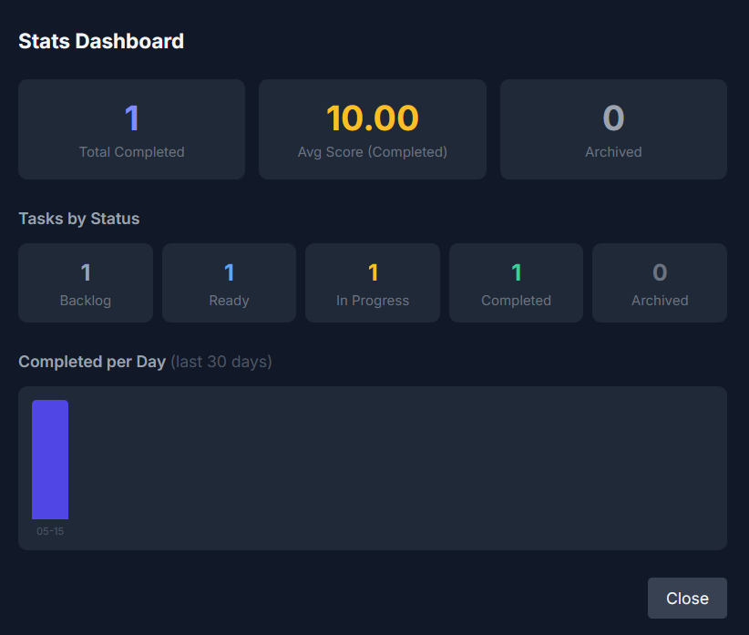

# Task Prioritizer

A personal task management app that helps you figure out **what to work on next**. Instead of a plain to-do list, every task gets a priority score based on how urgent and important it is — so the most critical work always rises to the top.

---

## Screenshots

**Kanban Board** — drag and drop tasks across columns


**Focus View** — your top 3 highest-priority tasks front and centre


**Eisenhower Matrix** — tasks plotted by urgency vs. importance


**Task Editor** — set urgency, importance, due date, subtasks, and dependencies


**Stats Dashboard** — track your completion history


---

## Features

- **Smart scoring** — each task is scored from 1–10 using urgency, importance, due dates, and how long the task has been sitting unfinished. The score updates automatically.
- **Recommended focus** — a banner at the top always highlights the single highest-priority task you should work on right now.
- **Kanban board** — drag and drop tasks across four columns: Backlog, Ready, In Progress, and Completed.
- **Focus view** — shows your top 3 highest-priority unblocked tasks as large cards, so you can start without thinking.
- **Eisenhower Matrix** — plots all your tasks visually by urgency vs. importance across four quadrants (Do Now, Schedule, Delegate, Eliminate).
- **Subtasks** — break any task into smaller steps with a progress bar.
- **Tags** — colour-coded labels to organise tasks by project, area, or anything you like.
- **Dependencies** — mark tasks as "blocked by" other tasks so blocked work is clearly flagged.
- **Activity log** — every change to a task (status, urgency, importance) is recorded with a timestamp.
- **Auto-archive** — completed tasks are automatically archived after a configurable number of days to keep your board clean.
- **Stats dashboard** — see how many tasks you've completed, their average priority score, and a day-by-day completion chart for the last 30 days.
- **Adjustable scoring weights** — tune how much urgency vs. importance matters to you from the Scoring panel.

---

## How the priority score works

```
Score = (Urgency × urgency_weight) + (Importance × importance_weight)
      + due_date_bonus (0–3 points)
      + age_bonus (0–3 points, grows +0.5 per week the task sits unfinished)
```

By default urgency and importance are weighted equally (50/50). You can change this in the **Scoring** panel.

---

## Requirements

You only need two things installed on your computer:

1. **Docker Desktop** — the free app that runs the whole project for you
2. **A terminal** (Command Prompt, PowerShell, or Terminal on Mac/Linux)

You do **not** need Python, Node.js, or any other programming tools.

---

## Getting started (step by step)

### Step 1 — Install Docker Desktop

1. Go to **[https://www.docker.com/products/docker-desktop](https://www.docker.com/products/docker-desktop)**
2. Click the download button for your operating system (Windows or Mac)
3. Open the downloaded file and follow the installer — click Next/Continue through all the steps
4. When it finishes, open **Docker Desktop** from your Start Menu or Applications folder
5. Wait until you see a green light or the message **"Docker Desktop is running"** in the app — this takes about 30–60 seconds the first time

> **Windows users:** If Docker asks you to install or update WSL 2 during setup, click Yes and follow the prompts. WSL 2 is a small Windows feature that Docker needs.

---

### Step 2 — Download this project

If you received this as a ZIP file:
1. Unzip it anywhere on your computer (e.g. your Desktop or Documents folder)

If you are downloading from GitHub:
1. Click the green **Code** button on the repository page
2. Click **Download ZIP**
3. Unzip the downloaded file

---

### Step 3 — Open a terminal in the project folder

**On Windows:**
1. Open the unzipped project folder in File Explorer
2. Click on the address bar at the top (where the folder path is shown)
3. Type `cmd` and press Enter — a black Command Prompt window will open

**On Mac:**
1. Open the unzipped project folder in Finder
2. Right-click (or Control-click) on the folder
3. Select **New Terminal at Folder**

---

### Step 4 — Start the app

In the terminal window, type the following command exactly and press **Enter**:

```
docker compose up --build
```

You will see a lot of text scroll by — this is normal. Docker is downloading and building everything the app needs. **This first run can take 3–5 minutes** depending on your internet speed.

The app is ready when you see lines that look like this:

```
frontend-1  | ...nginx started
backend-1   | Application startup complete.
```

---

### Step 5 — Open the app

Open any web browser (Chrome, Firefox, Edge, Safari) and go to:

**[http://localhost:3000](http://localhost:3000)**

The Task Prioritizer will load and you can start adding tasks.

---

## Stopping the app

Go back to your terminal and press **Ctrl + C** (hold the Control key and press C). Docker will shut everything down cleanly.

---

## Starting again later

Next time you want to use the app, just repeat Steps 3 and 4 — but the command is slightly shorter because everything is already built:

```
docker compose up
```

Your tasks and data are saved automatically between sessions.

---

## Frequently asked questions

**Is my data saved?**
Yes. All your tasks are stored in a local database file inside the `data/` folder in the project directory. Nothing is sent to the internet.

**How do I wipe all my data and start fresh?**
Stop the app, then delete the `data/tasks.db` file inside the project folder. The app will create a clean database next time it starts.

**The app won't open / I see an error.**
Make sure Docker Desktop is running (green status in the Docker app) before running `docker compose up`.

**The port 3000 is already in use.**
Another app on your computer is using that port. You can change it by opening `docker-compose.yml` in a text editor and changing `"3000:80"` to another number like `"3001:80"`, then access the app at `http://localhost:3001`.

---

## Project structure (for the curious)

```
├── backend/        Python API (FastAPI) — handles all data storage and scoring logic
├── frontend/       React web app — everything you see in the browser
├── data/           Your database lives here (created automatically, not included in the code)
├── docker-compose.yml          Production setup
└── docker-compose.dev.yml      Development setup (hot-reload, for developers)
```
